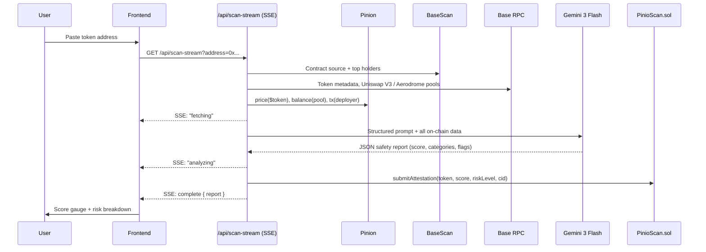
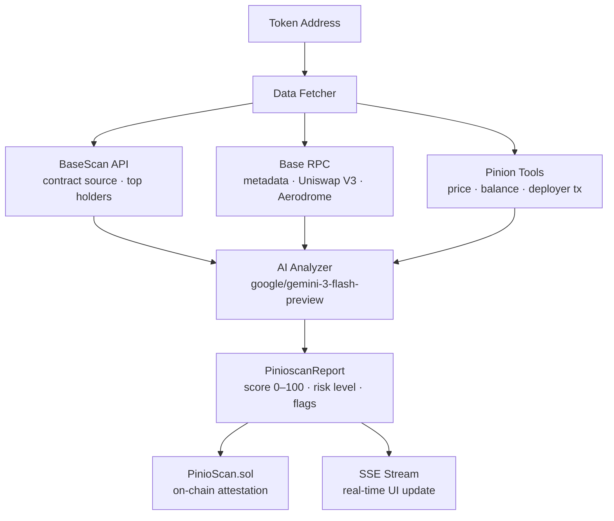

# Pinioscan — AI Token Safety on Base

Paste any Base token address → AI safety score → immutable on-chain attestation.

## How it works



## Architecture



## Risk Categories

| Category | Checks |
|---|---|
| Contract | Verified source, owner functions, mint/pause/blacklist |
| Holders | Top holder %, whale concentration, burned supply |
| Liquidity | Uniswap V3 / Aerodrome depth, lock status, USD value |
| Trading | Large transfers, deployer behavior, buy/sell tax |

## Pinion Tool Usage

| Tool | Used for | Cost |
|------|----------|------|
| `pinion_price` | Token USD price + market cap | $0.01 |
| `pinion_balance` | Pool liquidity (USD) + contract ETH balance | $0.01 each |
| `pinion_tx` | Decode deployer's first tx | $0.01 |
| `pinion_spend_limit` | Cap total spend at $0.05/scan | free |

## Stack

| Layer | Tech |
|-------|------|
| Frontend | Next.js 16 + React 19 + Tailwind v4 |
| AI | `google/gemini-3-flash-preview` via OpenRouter |
| On-chain data | BaseScan API + ethers.js → Base mainnet |
| DEX | Uniswap V3 factory + Aerodrome |
| Attestation | `PinioScan.sol` on Base (chain ID 8453) |
| Streaming | Server-Sent Events |

## Project Structure

```
pinioscan/
├── contracts/PinioScan.sol     # Attestation contract
├── build/                      # ABI + BIN (after solc compile)
├── scripts/deploy.js           # Deploy to Base mainnet
└── frontend/src/
    ├── app/
    │   ├── page.tsx            # Main scan UI
    │   ├── compare/            # Side-by-side comparison
    │   ├── portfolio/          # Wallet batch scanner
    │   ├── history/            # On-chain scan history
    │   ├── attestations/       # Browse attestations
    │   └── api/
    │       ├── scan-stream/    # SSE scan (primary)
    │       ├── scan/           # Non-streaming fallback
    │       ├── pinion-skill/   # x402 pay-per-scan ($0.10 USDC)
    │       ├── portfolio/      # Batch scan endpoint
    │       ├── attestations/   # Attestation lookup
    │       ├── history/        # History data
    │       └── total-scans/    # Contract counter
    ├── components/             # ScoreGauge, HolderChart, LiquidityPanel, TokenPicker…
    └── lib/
        ├── fetcher.ts          # Data pipeline + Pinion
        ├── analyzer.ts         # AI prompt + parsing
        ├── attester.ts         # Base attestation submission
        ├── chain.ts            # ABIs, addresses, Base RPC
        ├── cache.ts            # In-memory cache (6h TTL)
        └── types.ts            # PinioscanReport interface
```

## Setup

```bash
git clone https://github.com/your-org/pinioscan
cd pinioscan/frontend
bun install
cp ../.env.example .env.local  # fill in keys
bun dev
```

### Env vars

```bash
BASE_RPC_URL=https://mainnet.base.org
BASESCAN_API_KEY=            # basescan.org/apis
OPENROUTER_API_KEY=          # openrouter.ai
PINION_PRIVATE_KEY=          # wallet with USDC on Base
PINIOSCAN_CONTRACT_ADDRESS=  # set after deploying
DEPLOYER_PRIVATE_KEY=        # submits attestations
```

## Contract Deployment

```bash
# Compile
solc --abi --bin contracts/PinioScan.sol -o build

# Deploy to Base mainnet
node scripts/deploy.js
```

Copy the deployed address into `PINIOSCAN_CONTRACT_ADDRESS`.

## Pinion Skill (Pay-per-Scan)

```bash
POST /api/pinion-skill
{"address": "0x833589fCD6eDb6E08f4c7C32D4f71b54bdA02913"}
# → full PinioscanReport JSON, $0.10 USDC charged via x402
```

## License

MIT
